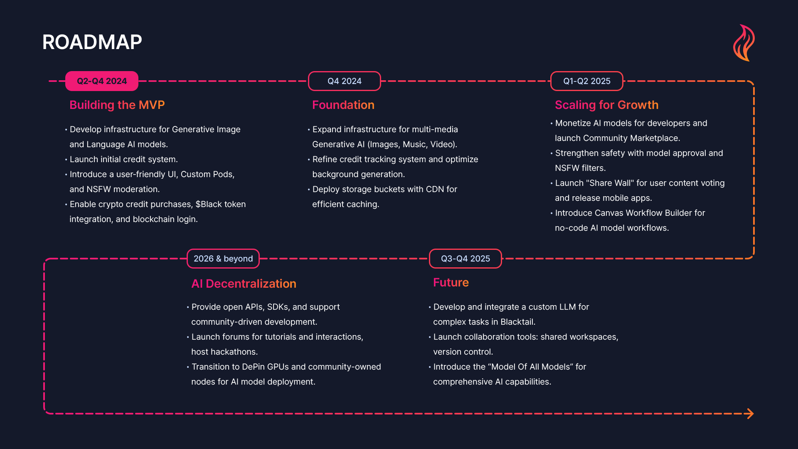

# :icon-rocket: Roadmap

Find Blacktail's extensive roadmap below.


The trends and technologies in the Web3 and AI space are rapidly evolving. While the roadmap provided serves as a guideline, it is not fixed. We will continuously adjust our plans to align with the latest developments and the needs of our community


:::link
[!ref icon="sparkle-fill" text="<h3>Building the MVP</h3>**_Phase 0_**  **(Q2-Q4 2024)**"](/litepaper/roadmap/0-building-the-mvp.md)
[!ref icon="browser" text="<h3>Building the Foundation</h3>**_Phase 1_**  **(Q4 2024)**"](/litepaper/roadmap/1-building-the-foundation.md)
:::
:::link
[!ref icon="mark-github" text="<h3>Scaling for Growth</h3>**_Phase 2_**  **(Q1-Q2 2025)**"](/litepaper/roadmap/2-scaling-for-growth.md)
[!ref icon="cpu" text="<h3>Embracing the Future</h3>**_Phase 3_**  **(Q3-Q4 2025)**"](/litepaper/roadmap/3-embracing-the-future.md)
:::
:::link
[!ref icon="globe" text="<h3>Decentralization of AI</h3>**_Phase 4_**  **(2026 and beyond)**"](/litepaper/roadmap/4-decentralization-of-ai.md)
:::
